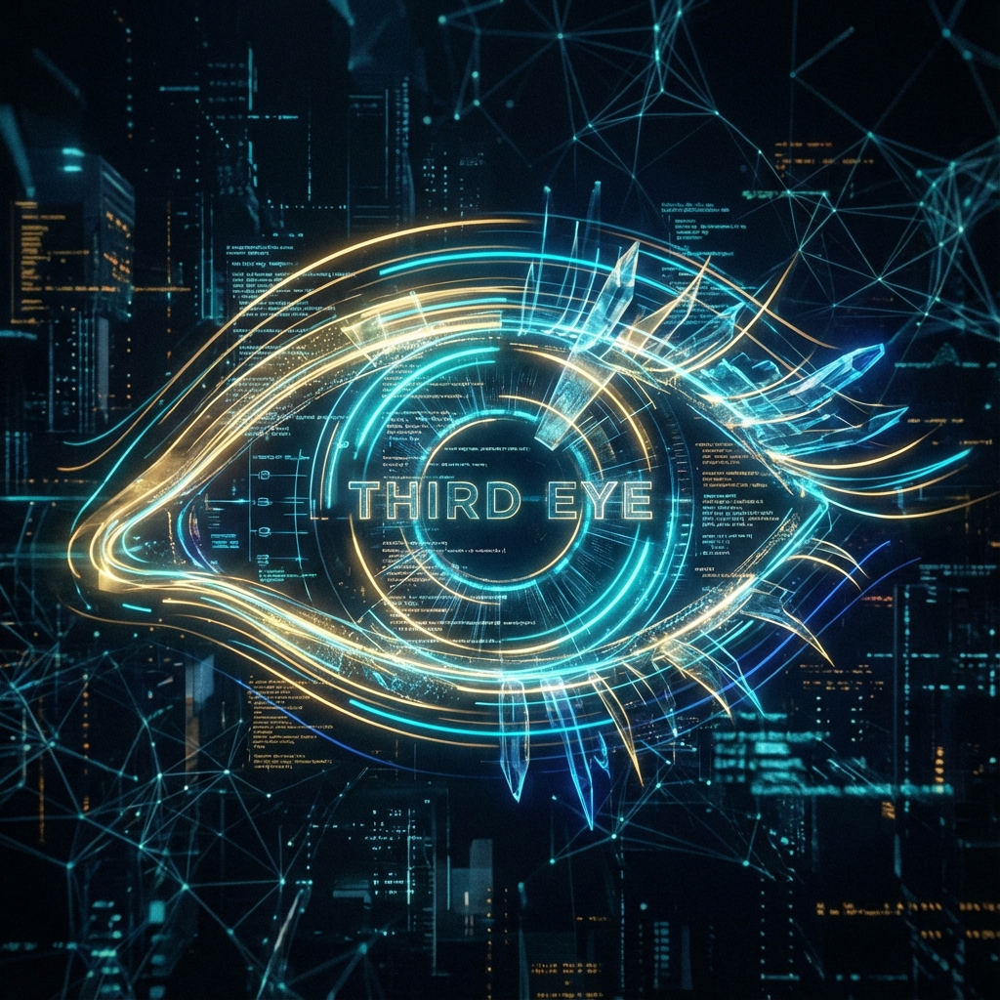
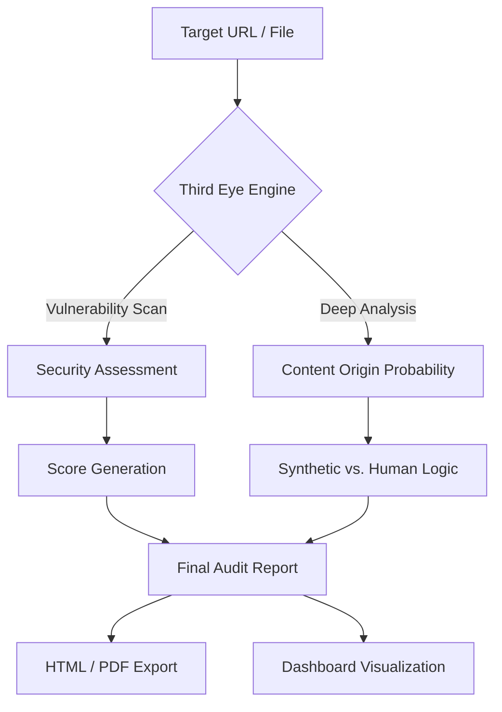

<p align="center">
  
</p>

# 👁️ THIRD EYE: Unseen Revealed

[](https://opensource.org/licenses/MIT)
[]()
[]()
[](https://www.kaggle.com/competitions/gemini-3/writeups/THIRD-EYE)

**THIRD EYE** is a premium, AI-powered security and content auditing ecosystem. It is designed to expose hidden vulnerabilities in web applications and provide detailed intelligence on content authenticity, distinguishing between human and synthetic origin with clinical precision.

---

## 🚀 Key Features

| Feature | Description |
| :--- | :--- |
| **🛡️ Security Audit** | Automated scanning for critical vulnerabilities and security posture scoring. |
| **🤖 Origin Detection** | High-precision analysis to identify AI-generated (Synthetic) content. |
| **📊 Interactive Dashboards** | Rich, detailed visualizations of audit results for developers and architects. |
| **📑 Automated Reporting** | Generates professional HTML and PDF reports with actionable insights. |
| **⚡ Real-time Prototype** | A live environment to test checkout flows and security implementations. |

---

## 🛠️ Architecture & Workflow

The following diagram illustrates how **THIRD EYE** processes data from ingestion to reporting:



---

## 💻 Technology Stack

- **Frontend**: React (v18+), TypeScript, Vite
- **Styling**: Premium Vanilla CSS with Glassmorphism and Cinematic Animations
- **Intelligence**: Gemini-powered analysis for content auditing
- **Visualization**: Recharts / Chart.js for data-driven insights

---

## 📁 Repository Structure

```tree
THIRD-EYE/
├── src/           # 📦 Core React/TypeScript Source Code
├── reports/       # 📊 Automated Security Audit Reports (HTML)
├── docs/          # 📑 Technical Documentation (PDF)
├── media/         # 🎥 Video Demos & Visual Assets
└── README.md      # 🏠 Project Overview
```

---

## 📺 Demo & Documentation

- **Video Demonstration**: [Watch on YouTube](https://youtu.be/veSYGxprbis?si=Bm7flClR6aE8pOxI)
- **Technical Writeup**: [Kaggle Writeup](https://www.kaggle.com/competitions/gemini-3/writeups/THIRD-EYE)

---

## 👤 Owner & Lead Developer

**Swetang Gajjar**
*Founder & Principal Architect, Archi-Tech Platform*

Empowering secure and authentic digital experiences through innovative AI implementation.

---
<p align="center">
  © 2025 THIRD EYE Project • Developed for the Gemini 3 Pro Hackathon
</p>
